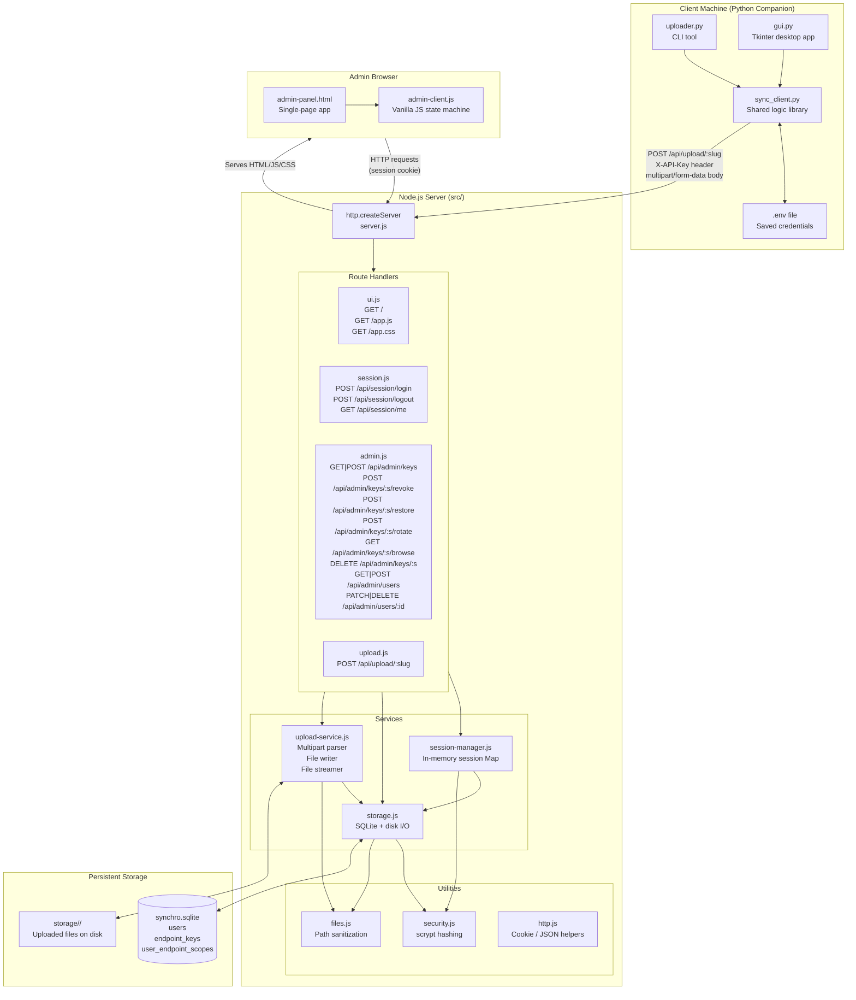
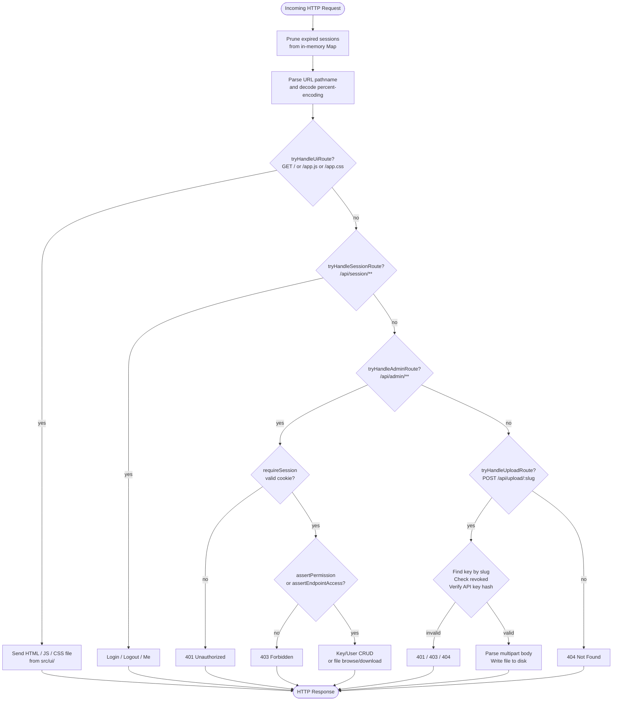
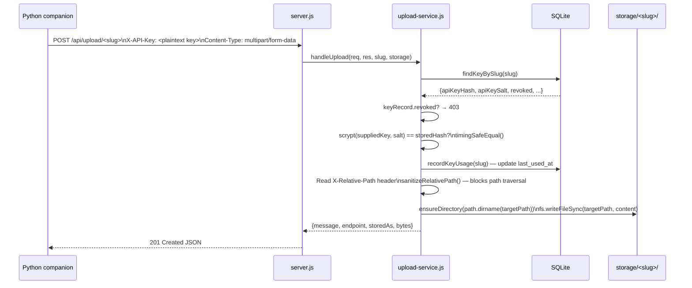
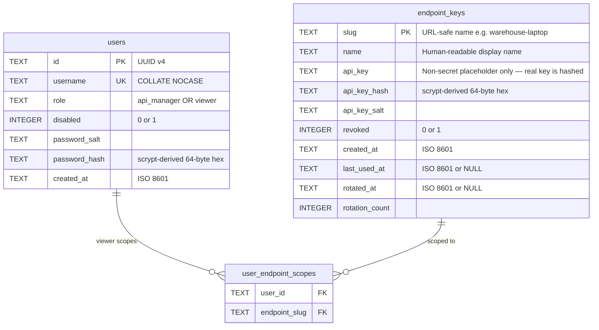
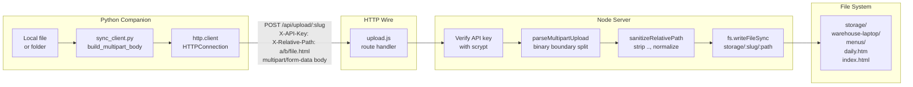
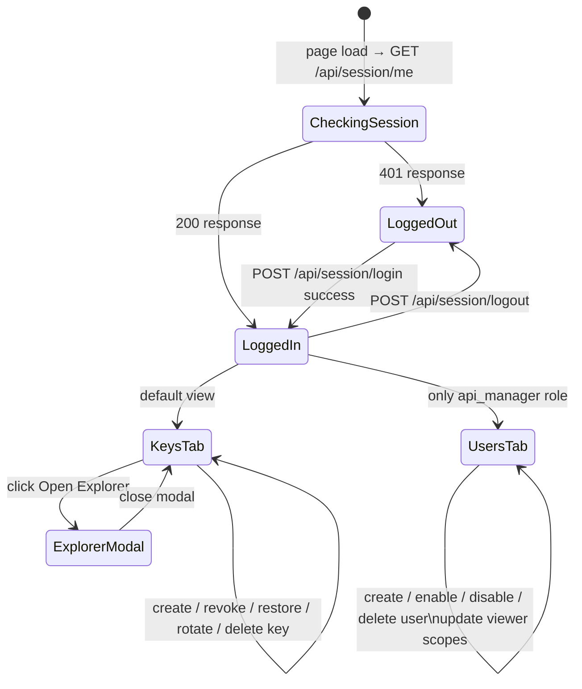
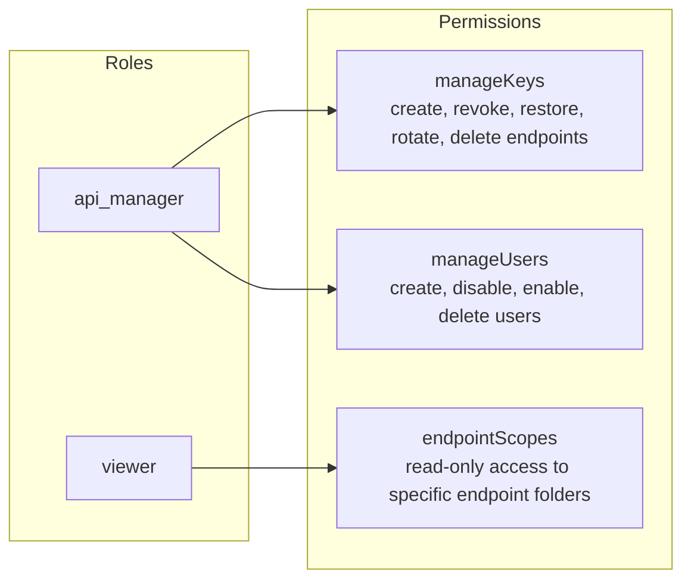
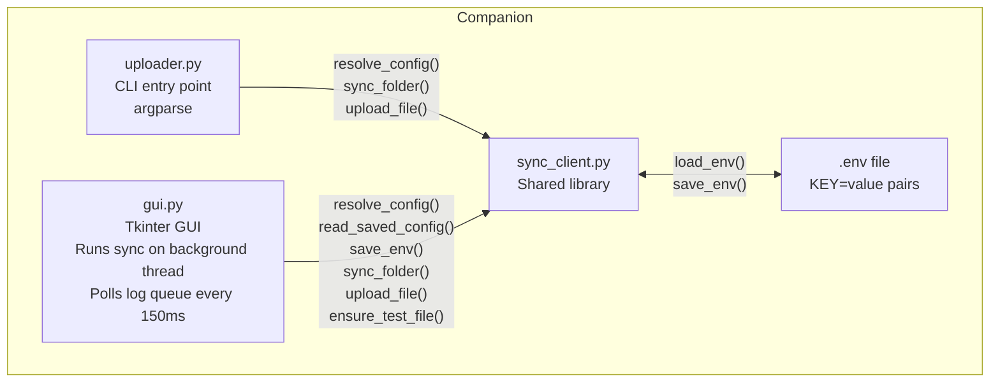
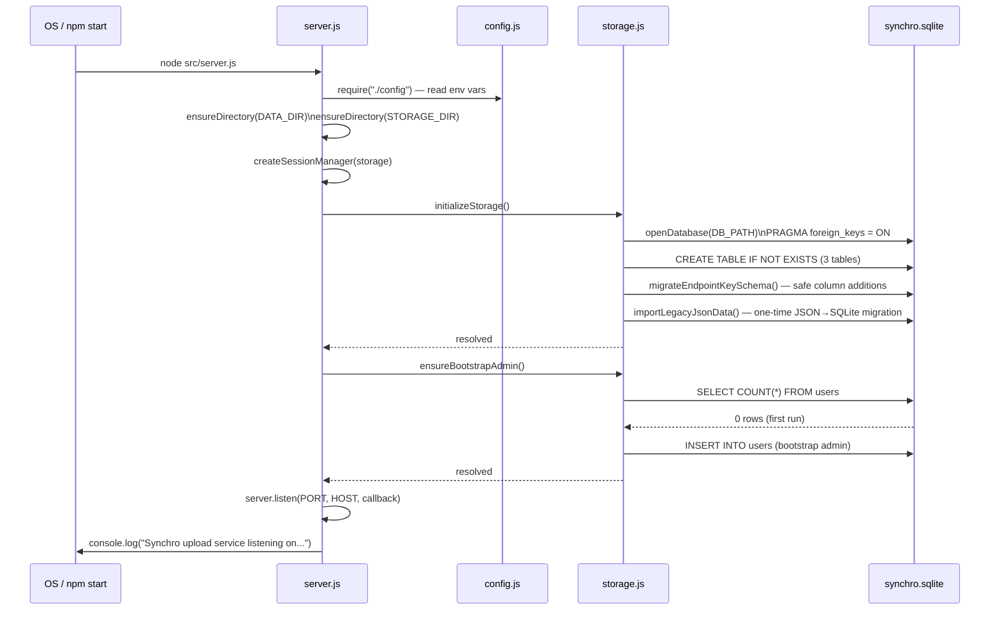

# Synchro Upload Service — Architecture Reference

> **Audience:** This document is written for two audiences simultaneously.
> - **LLMs ingesting this as context** — the prose sections give dense, unambiguous descriptions of every module, data flow, and design decision.
> - **Human readers** — the Mermaid diagrams give a visual map of the same information.

---

## 1. What the Application Is

Synchro is a **self-contained file-sync platform** with two halves:

| Half | Runtime | Purpose |
|---|---|---|
| **Server** | Node.js (no framework) | Receives file uploads, stores them on disk, provides a browser-based admin panel |
| **Companion** | Python 3 (stdlib only) | Sends files from a local machine to the server via HTTP |

The entire Node server runs on a single `http.createServer` call — there is no Express, Fastify, or any other web framework. Everything (routing, cookie handling, JSON parsing, multipart parsing) is implemented from scratch in the `src/` tree.

---

## 2. Repository Layout

```
synchro/
├── src/                        # Node.js server source
│   ├── server.js               # Entry point — wires everything together and starts HTTP server
│   ├── config.js               # All environment-driven constants in one place
│   ├── routes/
│   │   ├── admin.js            # /api/admin/** — key and user management (session-authenticated)
│   │   ├── session.js          # /api/session/** — login / logout / whoami
│   │   ├── ui.js               # / /app.js /app.css — serves the browser admin panel
│   │   └── upload.js           # /api/upload/:slug — receives file uploads (API-key-authenticated)
│   ├── services/
│   │   ├── session-manager.js  # In-memory session store; login, logout, permission checks
│   │   ├── storage.js          # All SQLite reads/writes plus on-disk folder operations
│   │   └── upload-service.js   # Multipart parsing, file writing, file download streaming
│   ├── ui/
│   │   ├── admin-panel.html    # The single HTML page served at /
│   │   ├── admin-panel.css     # Stylesheet served at /app.css
│   │   ├── admin-client.js     # Browser JavaScript served at /app.js (no bundler)
│   │   └── admin-ui.js         # Server-side module that reads and returns the UI files
│   └── utils/
│       ├── files.js            # Path sanitization, slug generation, directory helpers
│       ├── http.js             # Cookie parsing, JSON helpers, response senders
│       └── security.js         # scrypt password hashing and API key hashing
├── companion/                  # Python companion tools
│   ├── sync_client.py          # Core logic: config loading, multipart building, folder sync
│   ├── uploader.py             # CLI entry point wrapping sync_client
│   └── gui.py                  # Tkinter desktop GUI wrapping sync_client
├── data/                       # Runtime-created; holds synchro.sqlite
├── storage/                    # Runtime-created; one sub-folder per endpoint slug
└── package.json
```

---

## 3. System Architecture Diagram



---

## 4. Request Routing Flow

Every single HTTP request flows through one central function in `server.js`. There are no middleware chains — each route module exports a `tryHandle*` function that returns `true` if it handled the request, or `false` to pass it on.



---

## 5. Authentication & Session Model

The server uses **two completely separate authentication mechanisms**:

### 5a. Browser sessions (admin panel)

```mermaid
sequenceDiagram
    participant B as Browser
    participant S as server.js
    participant SM as session-manager.js
    participant DB as SQLite

    B->>S: POST /api/session/login {username, password}
    S->>SM: loginUser(username, password)
    SM->>DB: findUserByUsername(username)
    DB-->>SM: user row with passwordHash + passwordSalt
    SM->>SM: scrypt(password, salt) == hash?\ntimingSafeEqual()
    SM->>SM: crypto.randomBytes(32) → token\nStore {token, user, expiresAt} in Map
    SM-->>S: {token, user}
    S->>B: Set-Cookie: synchro_session=<token>; HttpOnly; SameSite=Strict; Max-Age=43200

    Note over B,S: Subsequent requests carry the cookie automatically

    B->>S: GET /api/admin/keys (with cookie)
    S->>SM: requireSession(req)
    SM->>SM: getCookie → look up token in Map
    SM->>DB: findUserById (re-hydrate fresh user)
    SM->>SM: Extend expiresAt by 12 hours
    SM-->>S: session object with user + permissions
    S-->>B: 200 {keys: [...]}
```

Sessions live **only in the Node.js process memory** — a server restart clears all active sessions and everyone must re-login.

### 5b. API key authentication (upload endpoint)



---

## 6. Database Schema

Synchro uses a single SQLite file at `data/synchro.sqlite`. There are three tables:



**Key design decisions:**
- API keys are **never stored in plaintext**. Only a scrypt hash + salt is kept. The plaintext key is shown once at creation/rotation and then discarded.
- The `api_key` column stores a non-secret placeholder string (e.g. `[hashed:warehouse-laptop]`), not the real key, for legacy migration compatibility.
- `user_endpoint_scopes` only matters for `viewer` role users. `api_manager` users bypass scope checks entirely.

---

## 7. Upload Data Flow (Python Companion → Server → Disk)



For **folder syncs**, `sync_client.py` calls `pathlib.Path.rglob("*")` to walk the directory tree recursively, then uploads each file individually with its path relative to the sync root set in the `X-Relative-Path` header. The server recreates the same directory structure under `storage/<slug>/`.

---

## 8. Admin Panel (Browser SPA)

The admin panel is a **vanilla-JS single-page application** — no React, Vue, or bundler. It is served as three static assets from `src/ui/`:

| Asset | Route | Description |
|---|---|---|
| `admin-panel.html` | `GET /` | The HTML shell (two views: auth form and app) |
| `admin-client.js` | `GET /app.js` | All JavaScript logic (~700 lines) |
| `admin-panel.css` | `GET /app.css` | Styles |

The JS holds a single `state` object:

```js
state = {
  user,          // currently logged-in user or null
  keys,          // array of endpoint records from /api/admin/keys
  users,         // array of user records from /api/admin/users
  activeTab,     // "keys" or "users"
  explorer: {    // file explorer modal state
    slug, name, currentPath, breadcrumbs, entries
  }
}
```

All UI re-renders are triggered imperatively — there is no reactivity framework. Functions like `renderKeys()` and `renderUsers()` clear and rebuild the relevant DOM nodes from the current `state`.



---

## 9. Permission Model



- `api_manager` derives both `manageKeys` and `manageUsers` from the role string alone — no separate permission rows in the database.
- `viewer` accounts get a row in `user_endpoint_scopes` for each endpoint slug they are allowed to browse.
- The `assertEndpointAccess` function short-circuits for managers (they see everything) and checks `user.endpointScopes` for viewers.

---

## 10. Python Companion Architecture



`sync_client.py` is the **shared kernel** — neither `uploader.py` nor `gui.py` duplicates upload logic. The GUI runs uploads on a background `threading.Thread` to keep the Tkinter event loop responsive. Results are posted to a `queue.Queue` and flushed into the log widget by the main thread via `root.after(150, ...)`.

---

## 11. Security Properties

| Property | Implementation |
|---|---|
| Password storage | scrypt (N=32768 by default via Node `crypto.scryptSync`) with a random 16-byte hex salt per user |
| API key storage | Same scrypt approach; plaintext key shown once and never persisted |
| Timing-safe comparison | `crypto.timingSafeEqual` used for both password and API key verification |
| Session tokens | 32 random bytes → 64-char hex string; stored server-side only in a `Map` |
| Session cookie flags | `HttpOnly`, `SameSite=Strict`, `Secure` (in production), `Max-Age=43200` |
| Path traversal prevention | `sanitizeRelativePath()` in `utils/files.js` rejects `..` segments and non-safe characters |
| Upload size cap | `MAX_UPLOAD_BYTES = 25 MB` enforced in `readRequestBuffer` before multipart parsing |
| Self-deletion prevention | `deleteUserRecord` compares target `userId` to the current session's `actorUserId` |
| Scope isolation | Viewer accounts cannot see or download files outside their assigned `endpointScopes` |

---

## 12. Configuration & Environment Variables

All configuration is centralized in `src/config.js`. Every value can be overridden by an environment variable:

| Variable | Default | Effect |
|---|---|---|
| `PORT` | `3000` | TCP port the server listens on |
| `HOST` | `0.0.0.0` | Bind address (all interfaces) |
| `NODE_ENV` | _(unset)_ | Set to `production` to add `Secure` flag to session cookie |
| `SYNCHRO_BOOTSTRAP_USER` | `admin` | Username for the auto-created first admin |
| `SYNCHRO_BOOTSTRAP_PASSWORD` | _(random)_ | Password for the auto-created first admin |

Python companion variables:

- `SynchroCompanion` stores these values in `companion/.env`.
- `SynchroCommander` stores the same `SYNCHRO_*` keys in `companion_commander/commander.env`.

| Variable | Effect |
|---|---|
| `SYNCHRO_SERVER` | Base URL of the Node server |
| `SYNCHRO_ENDPOINT` | Endpoint slug to upload to |
| `SYNCHRO_API_KEY` | Plaintext API key for the endpoint |
| `SYNCHRO_FOLDER` | Local folder to sync recursively |
| `SYNCHRO_PROFILE` | `default` or `verifone_commander` (HTML-only filter) |

---

## 13. Startup Sequence


